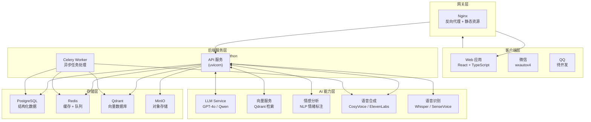
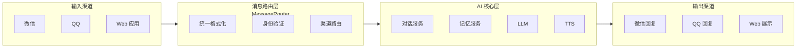
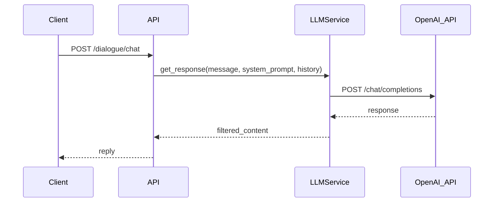
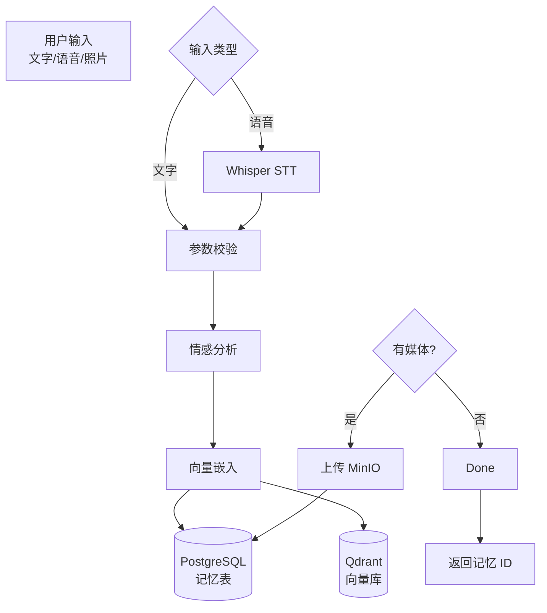
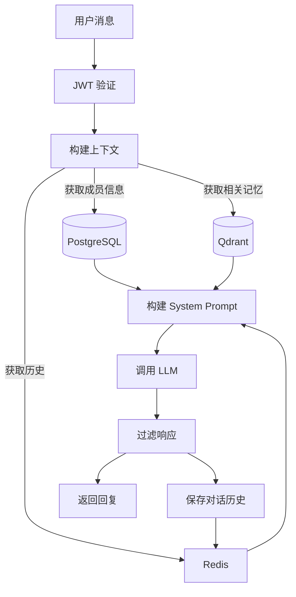

# MTC 系统架构说明

> Memory To Code — 用 AI 守护每一段珍贵的记忆

---

## 一、整体架构

MTC 采用经典的分层架构设计，前后端分离，AI 能力通过服务层集成。



---

## 二、技术架构详解

### 2.1 前端架构

**技术栈：** React 18 + Vite + TypeScript + Tailwind CSS

**核心特性：**

- 基于 Vite 的极速开发体验
- TypeScript 类型安全
- TanStack Query 数据获取和缓存
- Zustand 轻量级状态管理
- React Router v6 客户端路由
- 响应式设计，支持移动端

**目录结构：**

```
frontend/
├── src/
│   ├── components/          # 可复用组件
│   │   ├── memory/        # 记忆相关组件
│   │   ├── voice/         # 语音相关组件
│   │   ├── timeline/      # 时间线组件
│   │   └── ui/            # 通用 UI 组件
│   ├── pages/             # 页面组件
│   ├── hooks/             # 自定义 Hooks
│   ├── services/          # API 服务层
│   ├── stores/            # Zustand 状态管理
│   └── lib/               # 工具函数
```

---

### 2.2 后端架构

**技术栈：** FastAPI + Python 3.11 + SQLAlchemy 2.0

**核心设计理念：**

- **异步优先**：全面使用 async/await，最大化并发能力
- **依赖注入**：通过 FastAPI 的 Depends 实现清晰的分层
- **自动文档**：Swagger UI 和 ReDoc 零成本 API 文档
- **类型安全**：Pydantic v2 请求/响应验证

**目录结构：**

```
backend/
├── app/
│   ├── api/               # API 路由
│   │   └── v1/           # v1 版本接口
│   │       ├── auth.py    # 认证
│   │       ├── archive.py # 档案管理
│   │       ├── memory.py  # 记忆 CRUD
│   │       └── dialogue.py # AI 对话
│   ├── core/              # 核心模块
│   │   ├── config.py      # 配置管理
│   │   ├── database.py    # 数据库连接
│   │   └── security.py    # 安全工具
│   ├── models/            # SQLAlchemy ORM 模型
│   ├── schemas/           # Pydantic Schema
│   ├── services/           # 业务逻辑服务
│   │   ├── llm_service.py           # LLM 对话
│   │   ├── vector_service.py        # 向量检索
│   │   ├── emotion_service.py       # 情感分析
│   │   ├── voice_service.py         # 语音合成
│   │   ├── memory_organizer_service.py  # 记忆整理
│   │   └── channel_service.py       # 多渠道消息路由
│   ├── tasks/             # Celery 异步任务
│   └── main.py            # 应用入口
```

---

### 2.3 数据库架构

#### PostgreSQL（主数据库）

存储所有结构化业务数据：

- 用户表（User）
- 档案表（Archive）
- 成员表（Member）
- 记忆表（Memory）
- 记忆胶囊表（MemoryCapsule）

#### Qdrant（向量数据库）

专门用于记忆的语义检索：

- 记忆内容向量（1536 维 / 1024 维）
- 支持余弦相似度检索
- 带过滤条件的检索

#### Redis（缓存 + 消息队列）

- API 响应缓存
- 会话状态管理
- Celery 任务队列
- 实时消息推送（WebSocket 预留）

#### MinIO（对象存储）

- 用户上传的照片/视频
- 克隆的声纹模型文件
- 生成的语音文件
- 导出的故事书 PDF

---

## 三、多渠道接入架构

MTC 支持多种对话渠道，所有渠道统一接入 AI 对话服务层。

### 3.1 架构图



### 3.2 微信渠道（KouriChat 集成）

**技术方案：** wxautox4（Windows 微信自动化）

**消息流程：**

1. wxautox4 监听微信消息
2. 消息通过 HTTP POST 转发到 MTC 后端 `/api/v1/dialogue/chat`
3. MTC 后端调用 LLM 生成回复
4. 回复通过 wxautox4 发送回微信

**触发模式：**

| 模式 | 说明 |
|------|------|
| 私聊自动 | 所有私聊消息自动响应 |
| @触发 | 群聊中 @机器人触发 |
| 关键词触发 | 配置的关键词触发 |
| 全自动 | 无需触发，直接响应 |

### 3.3 QQ 渠道（待开发）

**技术方案：** NoneBot2 / go-cqhttp

**规划中：**

- 群聊接入
- CQ 码消息解析
- 统一路由到 MTC 对话服务

---

## 四、AI 能力架构

### 4.1 LLM 服务

整合 KouriChat 的 LLM Service 核心逻辑：



**关键特性：**

- OpenAI 兼容 API 支持
- 自动重试机制（tenacity）
- 思考内容过滤（R1 模型格式）
- 多轮上下文管理

### 4.2 向量检索服务

**流程：**

1. 记忆创建时 → 调用嵌入模型生成向量 → 存入 Qdrant
2. 语义搜索时 → 查询文本向量化 → Qdrant 相似度检索 → 返回 Top-K 结果

### 4.3 情感识别服务

- 基于 LLM 的零样本情感分类
- 支持 10 种中文情感标签
- 可批量处理

### 4.4 语音服务

- **TTS**：文字转语音（ElevenLabs / CosyVoice / Fish Audio）
- **声纹克隆**：用少量音频样本克隆声音
- **STT**：语音转文字（Whisper / SenseVoice）

---

## 五、数据流架构

### 5.1 记忆录入流程



### 5.2 对话生成流程



---

## 六、安全架构

### 6.1 认证与授权

- JWT Token 认证（24 小时过期）
- 密码 bcrypt 哈希
- 档案级权限控制（所有者/成员/查看者）

### 6.2 数据安全

- HTTPS 传输加密
- 敏感数据加密存储
- CORS 白名单控制
- SQL 注入防护（SQLAlchemy ORM）

### 6.3 隐私保护

- 端到端加密可选
- 私钥用户自持
- 数据导出与删除支持

---

## 七、部署架构

### 7.1 开发环境

```bash
# 一键启动所有服务
make docker-up

# 或分别启动
make backend   # FastAPI 后端
make frontend  # React 前端
```

### 7.2 生产环境

```bash
# Docker Compose 部署
make deploy

# 包含：
# - Nginx 反向代理
# - HTTPS 证书
# - 自动重启
# - 日志收集
```

### 7.3 服务端口

| 服务 | 端口 | 说明 |
|------|------|------|
| 后端 API | 8000 | FastAPI 应用 |
| 前端 | 5173 (dev) / 80 (prod) | React 应用 |
| PostgreSQL | 5432 | 主数据库 |
| Redis | 6379 | 缓存/队列 |
| Qdrant | 6333 / 6334 | 向量数据库 |
| MinIO | 9000 / 9001 | 对象存储 |
| PgAdmin | 5050 | 数据库管理（dev） |

---

*文档版本：v0.1.0 · 最后更新：2026-04-23*
